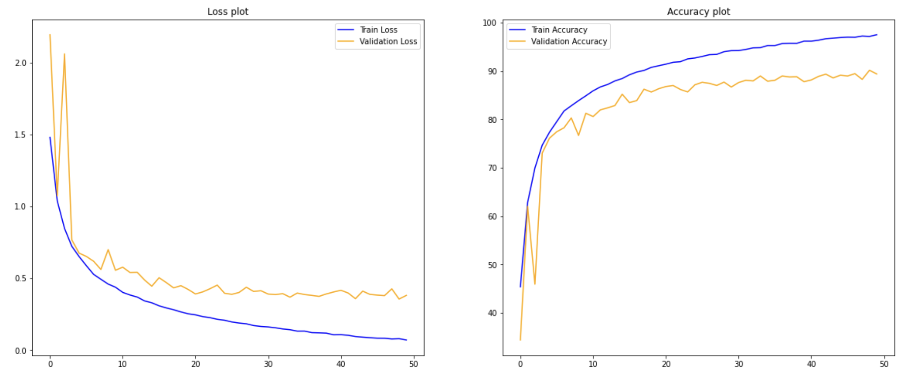
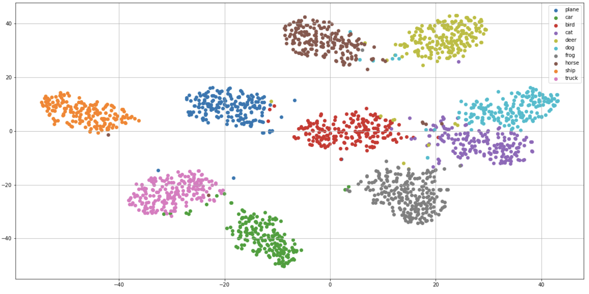

# Image-classification

In this repository, I implemented ResNet-18 model with PyTorch and I used it for classfying CIFAR-10 images which it has achieved 90% accuracy on test set.

## prerequesties
- Python 3.6+
- PyTorch
- Scikit-Learn

## ResNet-18 Architectute

<h3 align="center">
  
</h3>

## Training results

<h3 align="center">
  
</h3>

## Feature space visualization
For this part, I reduced the dimension of feature space vectors of CIFAR-10 images to two dimensions by using the T-SNE algorithm and visualized them here.

<h3 align="center">
  
</h3>
